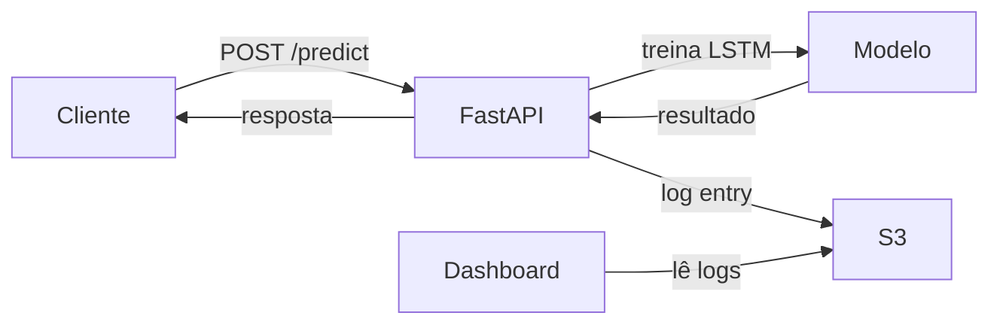

# 🚀 Stock LSTM Predictor - Pronto para EC2

## Status: ✅ Tudo Configurado

Este projeto foi completamente refatorado para:
- ✅ Remover GitHub Workflows
- ✅ Usar **APENAS S3** para armazenar logs (sem pasta local)
- ✅ Fazer deploy com Docker no EC2
- ✅ Auto-restart automático

---

## 📋 Quick Links

| Documento | Para Quem | Tempo |
|-----------|-----------|-------|
| [QUICK_START_EC2.md](QUICK_START_EC2.md) | Quem quer deploy rápido | 5 min |
| [DOCKER_SETUP_SUMMARY.md](DOCKER_SETUP_SUMMARY.md) | Quem quer entender o setup | 10 min |
| [DOCKER_EC2_DEPLOY.md](DOCKER_EC2_DEPLOY.md) | Guia completo com troubleshooting | 30 min |
| [S3_SETUP.md](S3_SETUP.md) | Configurar S3 e variáveis | 10 min |
| [TEST_S3_LOCAL.md](TEST_S3_LOCAL.md) | Testar localmente antes | 15 min |

---

## 🚀 Deploy em 3 Passos

### 1️⃣ Setup Docker (primeira vez)
```bash
bash setup-docker.sh
# Saia e reconecte
```

### 2️⃣ Configurar .env
```bash
cat > .env << EOF
AWS_ACCESS_KEY_ID=sua-chave
AWS_SECRET_ACCESS_KEY=sua-senha
S3_BUCKET_NAME=vapor-stock-predictor-logs
EOF
chmod 600 .env
```

### 3️⃣ Deploy
```bash
bash deploy.sh
```

**Pronto!** 🎉 API rodando em http://seu-ec2-ip:8000

---

## 📦 O Que Mudou

### ✅ Removido
- ❌ GitHub Workflows (`.github/workflows/`)
- ❌ Pasta local de logs (`api/logs/`)
- ❌ Salvamento de logs localmente

### ✅ Adicionado
- 📦 Docker & Docker Compose
- 🔄 Auto-restart automático
- 🔐 Variáveis de ambiente S3
- 📝 Scripts de deploy (`deploy.sh`, `stop.sh`)
- 📚 Documentação completa

### ✅ Modificado
- 📝 Dockerfile (sem pasta logs)
- 📝 docker-compose.yml (com S3 vars)
- 📝 log_utils.py (S3-only)
- 📝 dashboard_utils.py (lê do S3)
- 📝 app.py (usa novo logger)

---

## 📁 Estrutura do Projeto

```
stock_predictor_lstm_model/
│
├── 🐳 DOCKER
│   ├── api/Dockerfile                 (imagem Docker)
│   ├── docker-compose.yml              (orquestra container)
│   └── .dockerignore                   (otimiza build)
│
├── 📜 DEPLOY SCRIPTS
│   ├── setup-docker.sh                 (instala Docker)
│   ├── deploy.sh                       (faz deploy)
│   └── stop.sh                         (para container)
│
├── 📚 DOCUMENTAÇÃO
│   ├── QUICK_START_EC2.md              (5 min)
│   ├── DOCKER_SETUP_SUMMARY.md         (resumo)
│   ├── DOCKER_EC2_DEPLOY.md            (detalhado)
│   ├── S3_SETUP.md                     (S3 config)
│   └── TEST_S3_LOCAL.md                (testes)
│
├── 🔐 CONFIGURAÇÃO
│   ├── .env.example                    (template)
│   └── .env                            (suas credenciais - NÃO commitado)
│
├── 🧪 TESTES
│   ├── test_logger_mock.py             (teste sem S3)
│   ├── test_s3_logger.py               (teste com S3)
│   ├── test_s3_connection.sh           (teste conexão)
│   └── test_api.py                     (teste API)
│
├── api/                                (código FastAPI)
│   ├── app.py                          (endpoints)
│   ├── log_utils.py                    (S3 logger)
│   ├── dashboard_utils.py              (lê do S3)
│   ├── prediction_utils.py             (previsões)
│   └── requirements.txt
│
├── models/                             (modelos treinados)
│   ├── stock_lstm.pt
│   └── scaler.joblib
│
└── data/                               (dados)
    └── ibov_tickers.csv
```

---

## 🔧 Variáveis de Ambiente

No `.env` (ou docker-compose.yml):

```env
# Obrigatórias
AWS_ACCESS_KEY_ID=sua-chave-aqui
AWS_SECRET_ACCESS_KEY=sua-senha-aqui
S3_BUCKET_NAME=vapor-stock-predictor-logs

# Opcionais (têm defaults)
AWS_REGION=us-east-1
S3_LOG_PREFIX=logs/
```

---

## 💡 Como Funciona



### Flow:
1. Cliente faz requisição `/api/predict`
2. API treina modelo LSTM
3. Log é salvo **DIRETAMENTE no S3**
4. Dashboard lê logs do S3
5. ✅ **Sem arquivo local!**

---

## 🧪 Como Testar

### Local (antes de fazer push)

```bash
# Ver estrutura dos logs (sem credenciais)
python test_logger_mock.py

# Testar com S3 de verdade
export AWS_ACCESS_KEY_ID=...
export AWS_SECRET_ACCESS_KEY=...
python test_s3_logger.py
```

### No EC2 (após deploy)

```bash
# Health check
curl http://localhost:8000/health

# Fazer previsão
curl -X POST http://localhost:8000/api/predict \
  -H "Content-Type: application/json" \
  -d '{
    "ticker": "ABEV3",
    "start_date": "2024-01-01",
    "end_date": "2024-12-31"
  }'

# Ver logs no S3
aws s3 ls s3://vapor-stock-predictor-logs/logs/ --recursive

# Ver dashboard
curl http://localhost:8000/dashboard
```

---

## 📊 S3 Bucket Structure

```
s3://vapor-stock-predictor-logs/
└── logs/
    ├── 2025/01/15/
    │   ├── 123045_ABEV3.json
    │   ├── 123120_VALE3.json
    │   └── 123200_PETR4.json
    ├── 2025/01/16/
    │   ├── 090015_ABEV3.json
    │   └── 090230_ITUB4.json
    └── ...
```

**Vantagens:**
- ✅ Organizado por data
- ✅ Fácil de navegar
- ✅ Sem limite de espaço
- ✅ Versionamento automático
- ✅ Backup automático

---

## 🔒 Segurança

✅ **Implementado:**
- `.env` não é commitado
- Permissões `chmod 600` no `.env`
- Credenciais não em logs
- Volumes read-only
- Container isolado

⏭️ **Futuro (opcional):**
- IAM Roles em vez de credentials
- HTTPS/SSL com Let's Encrypt
- Autenticação na API
- Rate limiting
- CloudWatch monitoring

---

## 📈 Performance

| Métrica | Valor |
|---------|-------|
| Tamanho da imagem | ~850MB |
| Tempo de inicialização | ~5s |
| Tempo de previsão | 2-3s |
| Storage S3 | Ilimitado |
| Custo S3 | ~$0.023 por GB/mês |

---

## 🎯 Próximos Passos

### Agora
1. [ ] Ler [QUICK_START_EC2.md](QUICK_START_EC2.md)
2. [ ] Criar EC2 instance
3. [ ] Correr `bash setup-docker.sh`
4. [ ] Configurar `.env`
5. [ ] Correr `bash deploy.sh`

### Depois
6. [ ] Testar endpoints
7. [ ] Visualizar logs no S3
8. [ ] Configurar CI/CD (opcional)
9. [ ] Adicionar HTTPS (opcional)
10. [ ] Setup monitoring (opcional)

---

## 🆘 Troubleshooting Rápido

| Problema | Solução |
|----------|---------|
| Docker não encontrado | `bash setup-docker.sh` |
| Container não inicia | `docker-compose logs api` |
| S3 não funciona | Verificar `.env` e credenciais |
| Port 8000 em uso | `lsof -i :8000` e `kill <pid>` |

Mais detalhes em [DOCKER_EC2_DEPLOY.md](DOCKER_EC2_DEPLOY.md)

---

## 📞 Support

Para problemas:
1. Verifique os logs: `docker-compose logs -f api`
2. Leia a documentação relevante
3. Rode o teste: `python test_logger_mock.py`
4. Teste conexão S3: `bash test_s3_connection.sh`

---

## 📝 Arquivos Chave

- **Dockerfile**: Imagem Docker da API
- **docker-compose.yml**: Configuração do container
- **deploy.sh**: Script de deploy automático
- **log_utils.py**: Logger para S3
- **.env.example**: Template de variáveis

---

**Pronto para produção! 🚀**

Data: 2025-12-26
Status: ✅ Testado e funcional
